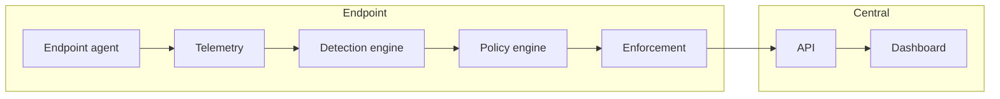

# Detec Architecture Overview

High-level flow of data and control in Detec.

## Flow

1. **Endpoint agent** collects telemetry (process, file, network) and runs named scanners plus behavioral detection.
2. **Detection engine** produces tool attribution and confidence; behavioral patterns (DETEC-BEH-CORE-01 through 04) run over the same telemetry.
3. **Policy engine** evaluates rules and produces a deterministic decision (detect, warn, approval_required, block).
4. **Enforcement** applies the decision (local or delegated to EDR/MDM when configured).
5. **API** ingests events and heartbeats, stores policy and config, and serves the dashboard.
6. **Dashboard** is the SOC operator UI for endpoints, policies, and audit.

## More detail

- [Behavioral core demo pack](behavioral-core-demo-pack.md)
- [Behavioral core policy mapping](behavioral-core-policy-mapping.md)
- [Playbook](../playbook/PLAYBOOK-v0.4-agentic-ai-endpoint-detection-governance.md) for detection methodology and rule catalog.
