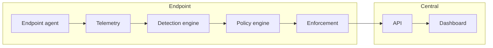

# Detec Architecture Overview

High-level flow of data and control in Detec.

## Flow

```mermaid
flowchart LR
  subgraph endpoint [Endpoint]
    Agent[Endpoint agent]
    Telemetry[Telemetry]
    Detection[Detection engine]
    Policy[Policy engine]
    Enforcement[Enforcement]
  end
  subgraph central [Central]
    API[API]
    Dashboard[Dashboard]
  end
  Agent --> Telemetry
  Telemetry --> Detection
  Detection --> Policy
  Policy --> Enforcement
  Enforcement --> API
  API --> Dashboard
```

1. **Endpoint agent** collects telemetry (process, file, network) and runs named scanners plus behavioral detection.
2. **Detection engine** produces tool attribution and confidence; behavioral patterns (DETEC-BEH-CORE-01 through 04) run over the same telemetry.
3. **Decision engine** (`collector/decision_engine.py`) evaluates detection results against policy and produces a deterministic decision (detect, warn, approval_required, block).
4. **Enforcement** (`collector/enforcement/` package) applies the decision. Tactics include process kill, network block, proxy injection, and approval hold. Posture configuration determines which tactics are active.
5. **Event builder** (`collector/event_builder.py`) constructs canonical event payloads for API submission.
6. **Orchestrator** (`collector/orchestrator.py`) coordinates the scan-detect-decide-enforce-emit pipeline.
7. **API** ingests events and heartbeats, stores policy and config, and serves the dashboard.
8. **Dashboard** is the SOC operator UI for endpoints, policies, and audit.

## More detail

- [Behavioral core demo pack](behavioral-core-demo-pack.md)
- [Playbook](../playbook/PLAYBOOK-v0.4.1-agentic-ai-endpoint-detection-governance.md) for detection methodology and rule catalog.
