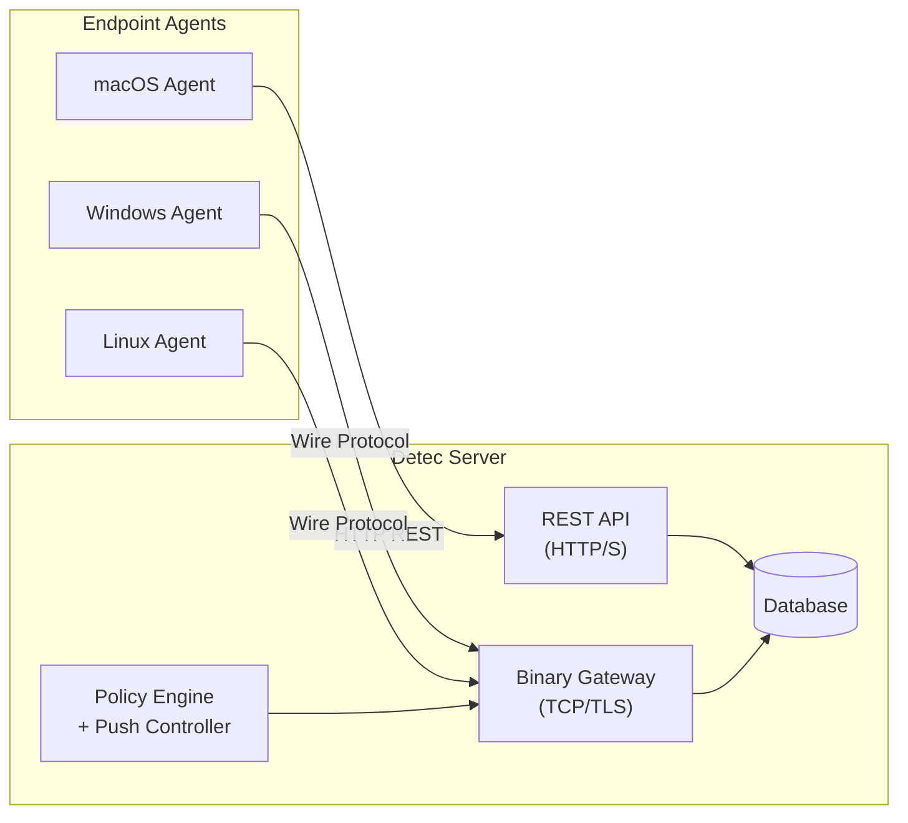

# Detec Wire Protocol

**Proprietary binary communication protocol for Detec endpoint agent-server telemetry.**

---

## Why a Custom Protocol

Detec agents scan endpoints for agentic AI tools, score confidence, evaluate policy, and report events to a central server. The first generation of this pipeline used standard HTTP REST: each scan cycle produced a batch of JSON payloads sent via `POST` to the API. This works, and Detec still supports it, but HTTP REST has structural limitations for endpoint security at scale.

**Connection overhead.** Every scan cycle opens a new TCP connection, performs a TLS handshake, serializes JSON, sends headers, waits for a response, and tears down the connection. For an agent scanning every 60 seconds across thousands of endpoints, this overhead is significant. Persistent connections eliminate it entirely.

**No server-initiated communication.** REST is request-response: the agent asks, the server answers. If the SOC pushes a new policy rule or needs to trigger an immediate scan on a specific endpoint, the agent has to poll for it. With a persistent binary channel, the server can push policy updates and remote commands to any connected agent in real time.

**Payload efficiency.** JSON is human-readable but verbose. Detection events contain nested objects (tool metadata, confidence dimensions, policy decisions, enforcement results) that compress dramatically under binary serialization. On metered or bandwidth-constrained networks, this matters.

We evaluated existing alternatives before building a custom protocol:

| Option | Why it was not sufficient |
|--------|--------------------------|
| gRPC | Requires HTTP/2, Protocol Buffers toolchain, and code generation. Adds build complexity to every platform target. The schema rigidity of protobuf conflicts with Detec's evolving event format. |
| MQTT | Designed for pub/sub IoT messaging, not request/response telemetry with acknowledgement tracking. Requires a separate broker process. |
| WebSocket | Requires an HTTP upgrade handshake and carries HTTP framing overhead. Better suited to browser-based real-time apps than headless endpoint agents. |
| Raw TCP + JSON | Solves the persistence problem but not the payload efficiency or framing problem. JSON over TCP requires delimiter-based parsing, which is fragile. |

The Detec Wire Protocol is purpose-built for the specific requirements of endpoint security telemetry: compact binary payloads, persistent authenticated connections, bidirectional push, and delivery guarantees, without introducing external dependencies or build toolchain requirements.

---

## Architecture Overview

Detec operates a dual-transport architecture. Agents choose their transport at setup time based on deployment constraints. Both paths converge to the same data model and policy engine on the server.

**HTTP REST transport** operates on port 8000. Agents send events via standard `POST` requests with JSON payloads. This is the simplest deployment option: it works through corporate proxies, requires no additional firewall rules beyond HTTPS, and integrates with existing API monitoring. It does not support server-push.

**Binary protocol transport** operates on a dedicated TCP port (default 8001). Agents establish a persistent, authenticated connection and exchange compact binary frames. The server can push messages back to any connected agent at any time. This is the high-performance option for environments where the SOC needs real-time control over fleet policy and scan behavior.

Both transports authenticate using the same API key mechanism and write to the same event store. Switching transport requires a single configuration flag; no agent reinstallation or re-enrollment is needed.

---

## Design Principles

### Binary Serialization

The wire format uses MessagePack for payload serialization. MessagePack is a binary format that is type-rich (integers, strings, maps, arrays, binary data), schema-flexible (no code generation or `.proto` files), and compact (typically 30-50% smaller than equivalent JSON for structured telemetry data). It is supported by mature libraries on every platform Detec targets.

### Length-Prefixed Framing

Every message on the wire is preceded by a fixed-size length header that declares the exact byte count of the payload that follows. This eliminates delimiter ambiguity (no escaping, no scanning for newlines or braces), enables incremental parsing (the reader knows exactly how many bytes to expect), and supports zero-copy buffer management. Partial frames are held in a buffer until complete; no data is discarded or re-read.

### Typed Message Envelope

Every frame carries a standardized envelope: a message type identifier, a monotonically increasing sequence number, and a timestamp. This structure enables several capabilities simultaneously:

- **Multiplexed request/response**: the server can process events out of order and acknowledge them by sequence ID, not by connection position.
- **Ack correlation**: the agent knows exactly which events were persisted and which were rejected, enabling selective retry without re-sending the entire batch.
- **Telemetry timing**: each frame carries its own timestamp, so the server can measure agent-to-server latency independently of processing delay.

The protocol defines a fixed taxonomy of message types covering authentication, event delivery, acknowledgement, heartbeat, policy distribution, and remote command execution. This taxonomy is purpose-built for endpoint security telemetry and is not derived from or compatible with any existing protocol specification.

### Bidirectional Push

Once an agent authenticates, the connection becomes fully bidirectional. The server maintains a session registry of all connected agents, indexed by endpoint identity. This enables:

- **Targeted policy push**: when a SOC operator updates a policy rule, the server can push the new rule set to a specific agent or group of agents immediately, without waiting for the next poll cycle.
- **Remote command execution**: the server can instruct a connected agent to perform an immediate scan, update its configuration, or shut down gracefully. The agent acknowledges each command with a result.
- **Fleet-wide broadcast**: a single API call on the server can push a message to every connected agent simultaneously.

This capability is architecturally impossible with HTTP REST, where all communication must be initiated by the client.

### Transport Encryption

All binary protocol connections support TLS 1.2 or higher. Deployments can choose server-only TLS (the agent verifies the server's certificate) or mutual TLS (both sides present certificates for environments requiring endpoint identity verification at the transport layer). Plaintext TCP is available for development and testing only; production deployments enforce encryption.

---

## Scalability

The protocol and its server-side gateway are designed for fleet-scale deployment.

### Connection Efficiency

Traditional HTTP agents open and close a connection for every scan cycle. For 10,000 agents scanning every 60 seconds, that is 10,000 TCP handshakes, 10,000 TLS negotiations, and 10,000 connection teardowns per minute. The binary protocol maintains persistent connections: one TCP session per agent, held open for the lifetime of the agent process. Connection establishment cost is paid once, at startup.

### Event Batching

Agents accumulate events during a scan cycle and send them as a single batch frame rather than individual requests. The batch size and timeout are configurable. A single batch frame containing 50 events requires one round trip and one acknowledgement, compared to 50 individual HTTP requests. This reduces server-side connection handling, parsing, and response overhead proportionally.

### Asynchronous Gateway

The server-side gateway uses an asynchronous, event-driven architecture (not thread-per-connection). A single gateway process can maintain thousands of concurrent agent connections with minimal memory overhead. I/O operations (reading frames, writing acknowledgements, querying the database) are non-blocking. Database writes are offloaded to a thread pool to avoid blocking the event loop during disk I/O.

### Session Registry

The gateway maintains a live registry of all authenticated agent sessions, indexed by endpoint identity. This registry enables O(1) lookup for targeted push operations and supports stale session eviction (if an agent reconnects, the previous session is closed automatically). The registry is the foundation for fleet-wide broadcast and per-endpoint remote command delivery.

### Selective Acknowledgement

The server acknowledges events by sequence ID, not by batch. If a batch of 50 events contains one that fails validation, the server ACKs the 49 that succeeded and NACKs the one that failed, with a reason. The agent retries only the failed event, not the entire batch. This prevents a single bad event from blocking the pipeline.

---

## Delivery Guarantees

The Detec Wire Protocol provides **at-least-once delivery** semantics for event telemetry.

**Agent side.** Every event is assigned a unique sequence ID when queued for transmission. The agent tracks which sequence IDs have been acknowledged by the server. If an acknowledgement is not received (due to disconnection, timeout, or NACK), the event is retried on the next connection. If the agent is disconnected for an extended period, queued events are spilled to a local on-disk buffer so they survive agent restarts and are re-sent when connectivity is restored.

**Server side.** The server deduplicates events by their canonical event ID. If the same event arrives twice (due to a retry after a missed ACK), the second copy is silently discarded. This makes the ingestion pipeline idempotent: retries are safe, and at-least-once delivery on the agent side becomes effectively-once delivery on the server side.

**Network partitions.** When the agent loses its connection to the server, it enters a reconnection loop with exponential backoff (capped at a configurable maximum). During disconnection, events continue to be generated by the scan pipeline and are queued in memory. If the disconnection exceeds a configurable threshold, the in-memory queue is flushed to local disk storage. When the connection is re-established, the local buffer is drained and all accumulated events are transmitted. No detection data is lost due to transient network failures.

---

## Proprietary Notice

The Detec Wire Protocol is proprietary technology developed by Detec. It is purpose-built for endpoint security telemetry and is not based on, derived from, or compatible with any existing open protocol specification.

The protocol implementation is shared as a single package between the endpoint agent and the central server to guarantee wire-level compatibility across versions. The message taxonomy, envelope format, and framing specification are internal to Detec and are not published as an open standard.

The protocol is licensed under the same terms as the Detec platform. See the [LICENSE](../LICENSE) file for details.

---

*For deployment and configuration, see [DEPLOY.md](../DEPLOY.md) and [SERVER.md](../SERVER.md).*
